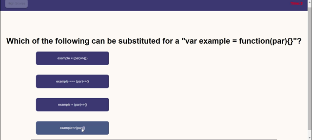

# code-quiz

Carleton Coding Bootcamp: Week 4 project (no source code provided).

## Main Objective

- To practice DOM manipulation in Vanilla JavaScript by making a single-page application.
- To work with setInterval() and clearInterval() timers in JavaScript
- To save player high scores in local storage

## Deployed Application
https://gitjanaew.github.io/code-quiz/